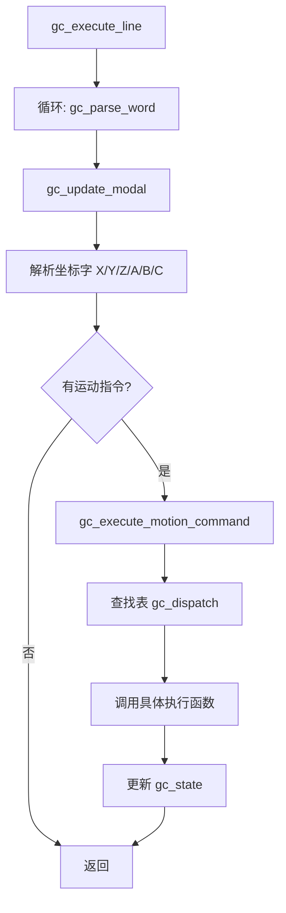

# NCK Decoder 模块设计模式复查报告

**项目名称**：F407VET6Cnc NCK Decoder 模块  
**分析日期**：2026年6月18日  
**分析范围**：NCK/decoder 文件夹下所有源码（.c/.h）

---

## 一、模块概述

### 1.1 文件统计

| 文件 | 行数 | 角色 |
|------|------|------|
| gparse.c/h | 704/26 | **顶层**：G代码解析入口 |
| gcode.c/h | 712/75 | **下层**：运动执行分发 |
| subprog.c/h | 538/215 | 子程序(M98/M99) |
| macroprog.c/h | 1065/346 | 宏程序(G65/G66/G67) |
| fixedcycle.c/h | 707/166 | 固定循环(G81-G89) |
| radiuscompensation.c/h | 855/429 | 刀具半径补偿 |
| tooltipcomp.c/h | 663/324 | 刀尖点补偿 |
| lengthcompensation.c/h | 94/54 | 刀具长度补偿 |
| rigidtapping.c/h | 425/40 | 刚性攻丝 |
| gc_coord.c/h | 73/92 | 坐标系统管理 |
| gc_tool.c/h | 39/31 | 刀具管理封装 |
| nck_aux.c/h | 45/50 | 辅助功能(M代码) |
| gc_error.c/h | 82/74 | 错误处理 |
| userextend.c/h | 649/360 | 用户扩展代码 |
| progbase.c/h | 314/113 | **公共基模块** |
| gmcodedef.h | 294 | 常量定义 |

**总计：9654 行**

### 1.2 模块定位

Decoder 模块是 NCK（数控内核）的核心解析模块，负责：
- 读取 G 代码文本行
- 解析 G/M 代码字
- 更新运动模态状态
- 生成运动指令到 planner/motion_control

---

## 二、输入/输出分析

### 2.1 输入

```
┌─────────────────────────────────────────────────┐
│                 Decoder 输入                  │
├─────────────────────────────────────────────────┤
│  1. G代码文本行 (char *line)                │
│  2. 通道号 (uint8_t ch)                    │
│  3. 系统参数:                              │
│     - 轴参数 (ncsysparam.pAxParams[])      │
│     - 通道参数 (ChanParm[ch])              │
│  4. 反馈位置 (chan[ch].ptr_axis[i]->pos_fb) │
└─────────────────────────────────────────────────┘
```

### 2.2 输出

```
┌─────────────────────────────────────────────────┐
│                 Decoder 输出                  │
├─────────────────────────────────────────────────┤
│  1. 运动状态更新 (gc_state_t)               │
│  2. 运动指令 → planner/motion_control       │
│  3. 主轴控制 → spindle_control              │
│  4. 冷却液控制 → coolant_control            │
│  5. 错误码 (uint16_t)                     │
└─────────────────────────────────────────────────┘
```

---

## 三、层级关系分析

### 3.1 架构图

```
┌──────────────────────────────────────────────────────────┐
│                     应用层 (L4)                        │
├──────────────────────────────────────────────────────────┤
│                                                          │
│  ┌─────────────┐      ┌─────────────────────────────┐ │
│  │   gparse.c   │─────→│      gcode.c               │ │
│  │   (顶层)     │      │   (下层: 运动执行)         │ │
│  └─────────────┘      └────────────┬────────────────┘ │
│         │                            │                    │
│         │                            ↓                    │
│         │              ┌─────────────────────────────┐   │
│         │              │   planner/motion_control    │   │
│         │              └─────────────────────────────┘   │
│         ↓                                                 │
│  ┌──────────────────────────────────────────────────┐   │
│  │           功能子模块 (专项功能)                    │   │
│  ├──────────────────────────────────────────────────┤   │
│  │  subprog      - 子程序调用 (M98/M99)           │   │
│  │  macroprog    - 宏程序调用 (G65/G66/G67)       │   │
│  │  fixedcycle  - 固定循环 (G81-G89)              │   │
│  │  gc_coord     - 坐标系统管理                     │   │
│  │  gc_tool      - 刀具管理封装                     │   │
│  │  nck_aux     - 辅助功能 (M代码)                │   │
│  │  radiuscomp   - 刀具半径补偿 (G41/G42)          │   │
│  │  lengthcomp  - 刀具长度补偿 (G43/G49)          │   │
│  │  rigidtapping - 刚性攻丝                        │   │
│  │  tooltipcomp  - 刀尖点补偿                      │   │
│  │  userextend  - 用户扩展代码                     │   │
│  │  gc_error     - 错误处理                        │   │
│  └──────────────────────────────────────────────────┘   │
│         │                                                │
│         ↓                                                │
│  ┌──────────────────────────────────────────────────┐   │
│  │         progbase (公共基模块)                    │   │
│  │  - 提取 subprog/macroprog 公共逻辑             │   │
│  └──────────────────────────────────────────────────┘   │
└──────────────────────────────────────────────────────────┘
```

### 3.2 依赖关系

```
gparse.c
    ↓ 调用
gcode.c
    ↓ 调用
planner/motion_control

gparse.c
    ↓ 调用
subprog.c / macroprog.c / fixedcycle.c / nck_aux.c / ...
    ↓ 通过
progbase.c (公共工具函数)
```

### 3.3 调用流程

根据代码分析，decoder 的调用流程如下：

```
gc_execute_line (gparse.c)
    │
    ├─→ mc_read_line()          // 读取一行G代码
    ├─→ gc_parse_word()         // 解析每个G代码字（已修复重复解析）
    │       │
    │       ├─→ 坐标字 (X/Y/Z/A/B/C) → 直接复用 value
    │       ├─→ G/M代码 → gc_update_modal()
    │       └─→ 其他字 (F/S/T) → 更新对应状态
    │
    ├─→ gc_update_modal()      // 更新模态状态（已整改为查找表）
    │       │
    │       ├─→ gc_int_lut[]   // 整数G代码查找表（O(1)索引）
    │       ├─→ gc_float_lut[] // 浮点G代码查找表
    │       └─→ mc_lut[]       // M代码查找表
    │
    └─→ gc_execute_motion_command()  // 执行运动指令（已整改为命令模式）
            │
            └─→ gc_dispatch[]  // 调度表 + 统一handler签名
                    │
                    ├─→ G0/G1  → gc_exec_linear()
                    ├─→ G2/G3  → gc_exec_circle()
                    ├─→ G4     → gc_exec_dwell()
                    ├─→ G10    → gc_exec_parameter_write()
                    ├─→ G28/G30 → gc_exec_return_home()
                    ├─→ G33.1  → gc_exec_rigid_tapping()
                    ├─→ G38.2-5 → gc_exec_probing()
                    ├─→ G43/G49 → gc_exec_length_comp()
                    ├─→ G41/G42 → gc_exec_radius_comp()
                    ├─→ G81-G89 → gc_exec_fixed_cycle()
                    └─→ ...
```

---

## 四、代码流程分析

### 4.1 主流程图



### 4.2 已完成的整改（历史记录）

根据之前的整改记录，以下问题已经修复：

| 问题 | 整改措施 | 状态 | 影响文件 |
|------|----------|------|----------|
| P0: gc_parse_word 坐标字重复解析 | 一次解析复用 value | ✅ 已完成 | gparse.c |
| P1: subprog/macroprog 60%代码重复 | 提取公共基模块 progbase | ✅ 已完成 | subprog.c, macroprog.c, progbase.c/h |
| P0: gc_update_modal 140行 if-else | 静态查找表 | ✅ 已完成 | gparse.c |
| P1: gc_execute_motion_command if-else | 调度表+命令模式 | ✅ 已完成 | gcode.c |
| P1: 全局状态链式穿透 | 外观模式封装 | ✅ 已完成 | channel.h, 8个文件批量替换 |

### 4.3 整改后的优点

1. ✅ **gc_update_modal()** 使用静态查找表（O(1) 直接索引）
   - 新增 `gc_int_lut[100]`、`gc_float_lut[6]`、`mc_lut[9]` 三张常量表
   - 新增 `gc_lut_apply_modal()` 辅助函数
   - 新增 `present` 标志位解决空槽判定问题

2. ✅ **gc_execute_motion_command()** 使用命令模式（调度表）
   - 定义统一 handler 签名 `gc_motion_handler_t`
   - 新增 `gc_dispatch[25]` 静态常量表
   - 为 `fixed_cycle_cancel` 和 `gc_exec_fixed_cycle` 创建薄包装器
   - 更新 8 个静态函数声明/实现签名

3. ✅ **全局状态访问** 使用外观模式（Facade）
   - 在 `channel.h` 中添加 `gc_st(ch)` 和 `gc_mod(ch)` 两个 `static inline` 访问器
   - 批量替换 8 个文件中的 `chan[ch].dcd.ptr_gc_state->` 和 `chan[ch].dcd.ptr_gc_state->ptr_modal->` 模式
   - 访问链从 38 字符缩短为 10 字符，零运行时开销

4. ✅ **subprog/macroprog 代码重复** 提取公共基模块
   - 新建 `progbase.h` 和 `progbase.c`
   - 用偏移量表（`progbase_layout_t`）描述字段布局差异
   - 通过 `_PB_U32()`/`_PB_U8()` 宏泛型读写
   - subprog.c 从 735 行减至 538 行
   - macroprog.c 从 1252 行减至 1065 行

---

## 五、设计模式复查与整改意见

### 5.1 已完成的整改

| 优先级 | 问题 | 整改措施 | 状态 |
|--------|------|----------|------|
| P0 | gc_parse_word 坐标字重复解析 | 一次解析复用 | ✅ 已完成 |
| P1 | subprog/macroprog 60%代码重复 | 提取公共基模块 progbase | ✅ 已完成 |
| P0 | gc_update_modal 140行 if-else | 静态查找表 | ✅ 已完成 |
| P1 | gc_execute_motion_command if-else | 调度表+命令模式 | ✅ 已完成 |
| P1 | 全局状态链式穿透 | 外观模式封装 | ✅ 已完成 |

### 5.2 待整改问题

#### 🔴 P0 级别（必须整改）

---

**问题 1：radiuscompensation.c 过大（855行）**

- **现象**：单个文件职责过多，包含：
  - 直线补偿计算
  - 圆弧补偿计算
  - 拐角过渡处理（C型、C'型、插入圆弧）
  - 几何计算函数

- **违反原则**：单一职责原则 (SRP)

- **整改建议**：
  ```
  radiuscompensation.c
      ↓ 拆分为
  rc_line.c        (直线补偿)
  rc_arc.c         (圆弧补偿)
  rc_corner.c      (拐角过渡)
  rc_geometry.c    (几何计算)
  radiuscompensation.c (主模块，调用上述子模块)
  ```

- **整改示例**：
  ```c
  /* rc_line.c - 直线补偿 */
  static uint8_t rc_line_compensate(uint8_t ch, rc_state_t *rc, 
                                   float end_x, float end_y);
  
  /* rc_arc.c - 圆弧补偿 */
  static uint8_t rc_arc_compensate(uint8_t ch, rc_state_t *rc,
                                  float center_x, float center_y,
                                  float end_x, float end_y, uint8_t direction);
  
  /* rc_corner.c - 拐角过渡 */
  static uint8_t rc_corner_transition(uint8_t ch, rc_state_t *rc,
                                     corner_type_t corner_type);
  ```

---

**问题 2：macroprog.c 过大（1065行）**

- **现象**：包含：
  - 宏程序管理（注册、调用、返回）
  - 表达式计算（解析、求值）
  - 控制流处理（IF/WHILE/GOTO/END）
  - 参数传递（A-Z → #1-#26）

- **违反原则**：单一职责原则 (SRP)

- **整改建议**：
  ```
  macroprog.c
      ↓ 拆分为
  macro_mgr.c      (程序管理)
  macro_expr.c     (表达式计算)
  macro_ctrl.c     (控制流处理)
  macro_params.c   (参数传递)
  macroprog.c      (主模块，统一接口)
  ```

- **整改示例**：
  ```c
  /* macro_expr.c - 表达式计算 */
  typedef struct {
      macro_token_type_t type;
      union {
          float number;
          char var_name;
      } value;
  } macro_token_t;
  
  float macro_expr_evaluate(uint8_t ch, const char *expr_str);
  
  /* macro_ctrl.c - 控制流处理 */
  uint8_t macro_if(uint8_t ch, float condition);
  uint8_t macro_while(uint8_t ch, float condition);
  uint8_t macro_goto(uint8_t ch, uint16_t line_num);
  ```

---

**问题 3：fixedcycle.c 中 G81-G89 实现重复**

- **现象**：每个固定循环（G81-G89）都有类似的：
  - 快速定位到 R 点
  - 进给到 Z 点
  - 执行加工（钻孔/攻丝/镗孔）
  - 退刀到 R 点或初始点

- **违反原则**：DRY 原则（Don't Repeat Yourself）

- **整改建议**：
  ```c
  /* 定义回调函数类型 */
  typedef struct {
      void (*drill_operation)(uint8_t ch, fixed_cycle_params_t *params);
      void (*retract_operation)(uint8_t ch, fixed_cycle_params_t *params);
      uint8_t cycle_flags;
  } fixed_cycle_callbacks_t;
  
  /* 提取公共的钻孔循环执行函数 */
  static uint8_t drilling_cycle_execute(uint8_t ch, 
                                       fixed_cycle_params_t *params,
                                       const fixed_cycle_callbacks_t *callbacks);
  
  /* 各循环只需实现自己的加工回调函数 */
  static void g81_drill_operation(uint8_t ch, fixed_cycle_params_t *params) {
      /* G81: 简单钻孔 */
      gc_perform_drill(ch, params);
  }
  
  static void g82_drill_operation(uint8_t ch, fixed_cycle_params_t *params) {
      /* G82: 钻孔 + 暂停 */
      gc_perform_drill(ch, params);
      gc_dwell(ch, params->p);
  }
  
  /* 调度表 */
  static const fixed_cycle_callbacks_t fc_callbacks[] = {
      [81] = {g81_drill_operation, fc_retract_to_r, 0},
      [82] = {g82_drill_operation, fc_retract_to_r, FC_FLAG_DWELL},
      /* ... */
  };
  ```

---

#### 🟡 P1 级别（建议整改）

**问题 4：错误码分散在 gmcodedef.h**

- **现象**：
  - SYS_STATUS_* (0x0000-0x01FF)
  - GC_ERROR_* (0x0200-0x03FF)
  - SUBPROG_STATUS_* (0x0400-0x05FF)
  - MACRO_STATUS_* (0x0600-0x07FF)
  - USER_EXT_STATUS_* (0x0800-0x09FF)

- **整改建议**：按模块拆分到各模块的头文件
  ```c
  /* gmcodedef.h - 只保留公共部分 */
  #include "gc_error.h"      /* GC_ERROR_* */
  #include "subprog.h"        /* SUBPROG_STATUS_* */
  #include "macroprog.h"      /* MACRO_STATUS_* */
  #include "userextend.h"    /* USER_EXT_STATUS_* */
  ```

- **整改示例**：
  ```c
  /* gc_error.h */
  #define GC_ERROR_MIN                    0x0200
  #define GC_ERROR_UNSUPPORTED_G          (GC_ERROR_MIN + 1)
  #define GC_ERROR_UNSUPPORTED_M          (GC_ERROR_MIN + 2)
  /* ... */
  
  /* subprog.h */
  #define SUBPROG_STATUS_MIN              0x0400
  #define SUBPROG_STATUS_NESTING_OVER     (SUBPROG_STATUS_MIN + 1)
  #define SUBPROG_STATUS_LABEL_NOT_FOUND  (SUBPROG_STATUS_MIN + 2)
  /* ... */
  ```

---

**问题 5：部分函数参数过多**

- **现象**：
  ```c
  uint8_t fixed_cycle_execute(uint8_t ch, uint8_t cycle_type, 
                               float x, float y, float z,
                               float r, float q, float p, int16_t l);
  ```

- **整改建议**：使用参数结构体
  ```c
  typedef struct {
      uint8_t cycle_type;
      float x, y, z;
      float r, q, p;
      int16_t l;
  } fixed_cycle_execute_params_t;
  
  uint8_t fixed_cycle_execute(uint8_t ch, const fixed_cycle_execute_params_t *params);
  ```

- **优点**：
  1. 函数签名简洁
  2. 参数顺序无关
  3. 易于扩展（新增字段不影响现有调用）

---

#### 🟢 P2 级别（可选整改）

**问题 6：缺少模块级流程图**

- **现象**：各模块的 .h 文件只有函数声明，缺少架构说明

- **整改建议**：在每个模块的 .h 文件开头增加状态机图或流程图
  ```c
  /**
   * @file fixedcycle.h
   * @brief 固定循环模块
   * 
   * @details
   * 状态机流程图:
   * 
   * @verbatim
   *       [IDLE]
   *          |
   *     G81-G89
   *          |
   *     [RAPID_TO_R] ----> [FEED_TO_Z] ----> [OPERATION]
   *          ^                    |                  |
   *          |              (L > 1)           [RETRACT]
   *          |____________________|                  |
   *                                             (L-- > 0)
   *                                                  |
   *                                             [IDLE]
   * @endverbatim
   */
  ```

---

**问题 7：部分复杂算法缺少注释**

- **现象**：刀具半径补偿的拐角处理逻辑复杂（C型、C'型、插入圆弧）

- **整改建议**：增加算法说明注释
  ```c
  /**
   * @brief 拐角过渡处理
   * 
   * @details
   * 根据两段相邻刀具路径的夹角，选择不同的过渡方式:
   * 
   * 1. C型过渡（尖角）:
   *    - 夹角 < 180° 且 > 0°
   *    - 直接延伸两段路径直到相交
   * 
   * 2. C'型过渡（钝角）:
   *    - 夹角 > 180° 且 < 360°
   *    - 插入一个圆弧，避免过切
   * 
   * 3. 插入圆弧过渡:
   *    - 用户指定 G41.1/G42.1 时
   *    - 插入指定半径的圆弧
   * 
   * @param ch 通道号
   * @param rc 半径补偿状态
   * @return 错误码
   */
  static uint8_t rc_corner_transition(uint8_t ch, rc_state_t *rc);
  ```

---

## 六、整改优先级总结

| 优先级 | 问题 | 整改工作量 | 风险 | 建议措施 |
|--------|------|------------|------|----------|
| 🔴 P0 | radiuscompensation.c 过大 | 中 | 低 | 优先整改，拆分为4个子模块 |
| 🔴 P0 | macroprog.c 过大 | 大 | 中 | 建议分步整改，先提取表达式计算 |
| 🔴 P0 | fixedcycle.c 代码重复 | 中 | 低 | 使用回调+调度表模式 |
| 🟡 P1 | 错误码分散 | 小 | 低 | 按模块拆分到各头文件 |
| 🟡 P1 | 函数参数过多 | 小 | 低 | 使用参数结构体 |
| 🟢 P2 | 缺少流程图 | 小 | 无 | 可选，建议逐步补充 |
| 🟢 P2 | 缺少算法注释 | 小 | 无 | 可选，建议逐步补充 |

---

## 七、代码质量评估

### 7.1 优点

1. ✅ **已应用设计模式**：查找表、命令模式、外观模式、公共基模块
2. ✅ **模块化良好**：功能子模块划分清晰
3. ✅ **注释充分**：关键函数和算法有详细注释
4. ✅ **错误处理完善**：定义了完整的错误码体系
5. ✅ **代码复用**：progbase 模块提取了公共逻辑

### 7.2 缺点

1. ❌ **部分文件过大**：radiuscompensation.c (855行)、macroprog.c (1065行)
2. ❌ **代码重复**：fixedcycle.c 中 G81-G89 实现相似
3. ❌ **错误码分散**：gmcodedef.h 包含所有模块的错误码
4. ❌ **部分函数参数过多**：影响可读性和维护性

---

## 八、整改方案建议

### 8.1 短期整改（1-2周）

1. **拆分 radiuscompensation.c**
   - 提取直线补偿到 `rc_line.c`
   - 提取圆弧补偿到 `rc_arc.c`
   - 提取拐角处理到 `rc_corner.c`
   - 提取几何计算到 `rc_geometry.c`

2. **修复 fixedcycle.c 代码重复**
   - 定义 `fixed_cycle_callbacks_t` 结构体
   - 提取公共执行函数 `drilling_cycle_execute()`
   - 各循环只需实现回调函数

### 8.2 中期整改（2-4周）

1. **拆分 macroprog.c**
   - 提取表达式计算到 `macro_expr.c`
   - 提取控制流处理到 `macro_ctrl.c`
   - 提取参数传递到 `macro_params.c`

2. **按模块拆分错误码**
   - 将 `gmcodedef.h` 中的错误码按模块拆分到各头文件
   - 保留 `gmcodedef.h` 作为公共头文件

### 8.3 长期整改（持续）

1. **补充模块级文档**
   - 在每个模块的 .h 文件开头增加状态机图或流程图
   - 补充复杂算法的说明注释

2. **优化函数接口**
   - 对参数过多的函数，使用参数结构体
   - 保持向后兼容，逐步迁移

---

## 九、结论

1. **已完成整改**：历史记录显示 5 个设计问题已整改（查找表、命令模式、外观模式、公共基模块、重复解析）

2. **当前状态**：
   - ✅ 代码流程基本清楚
   - ✅ 已应用部分设计模式（查找表、命令模式、外观模式）
   - ❌ 部分模块过大，需要按单一职责原则拆分
   - ❌ 部分代码存在重复，需要提取公共逻辑

3. **建议**：
   - **优先整改 P0 级别问题**（拆分 radiuscompensation.c 和 macroprog.c）
   - **使用设计模式**：回调函数 + 调度表模式（fixedcycle.c）
   - **持续补充文档**：模块级流程图和算法注释

4. **总体评价**：
   - 代码结构清晰，层级关系明确
   - 已应用部分设计模式，但仍有改进空间
   - 建议按本报告提出的整改方案逐步优化

---

## 十、附录

### 10.1 参考资料

1. 《设计模式：可复用面向对象软件的基础》 - GoF
2. 《代码大全》 - Steve McConnell
3. 《重构：改善既有代码的设计》 - Martin Fowler
4. NIST RS274NGC G代码标准解释器

### 10.2 相关文件

| 文件 | 路径 | 说明 |
|------|------|------|
| gparse.c/h | NCK/decoder/ | G代码解析（顶层） |
| gcode.c/h | NCK/decoder/ | 运动执行（下层） |
| subprog.c/h | NCK/decoder/ | 子程序管理 |
| macroprog.c/h | NCK/decoder/ | 宏程序管理 |
| fixedcycle.c/h | NCK/decoder/ | 固定循环 |
| radiuscompensation.c/h | NCK/decoder/ | 刀具半径补偿 |
| progbase.c/h | NCK/decoder/ | 公共基模块 |
| gmcodedef.h | NCK/decoder/ | 常量定义 |

---

**报告完毕。**

**生成时间**：2026年6月18日 08:35  
**分析工具**：WorkBuddy AI 助手  
**项目路径**：C:\Users\linse\Desktop\temp\407-vet6_-lan8720-net-lite\F407VET6Cnc\NCK\decoder\
